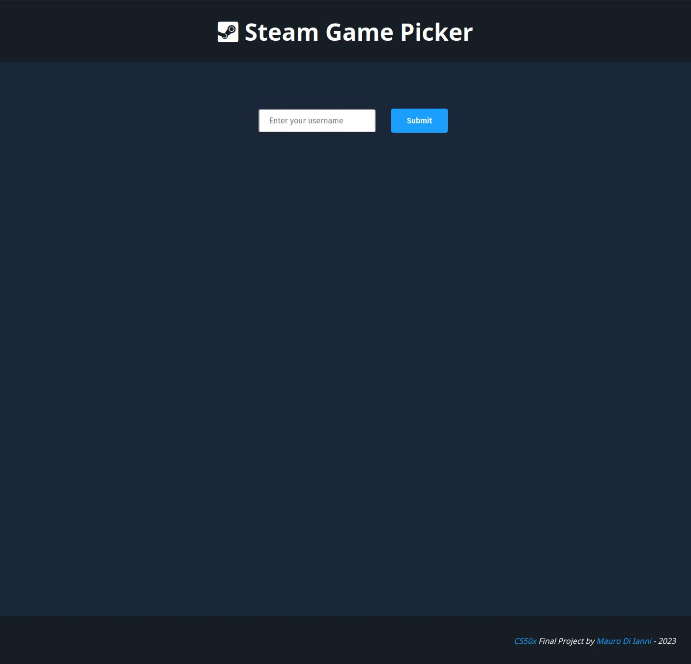
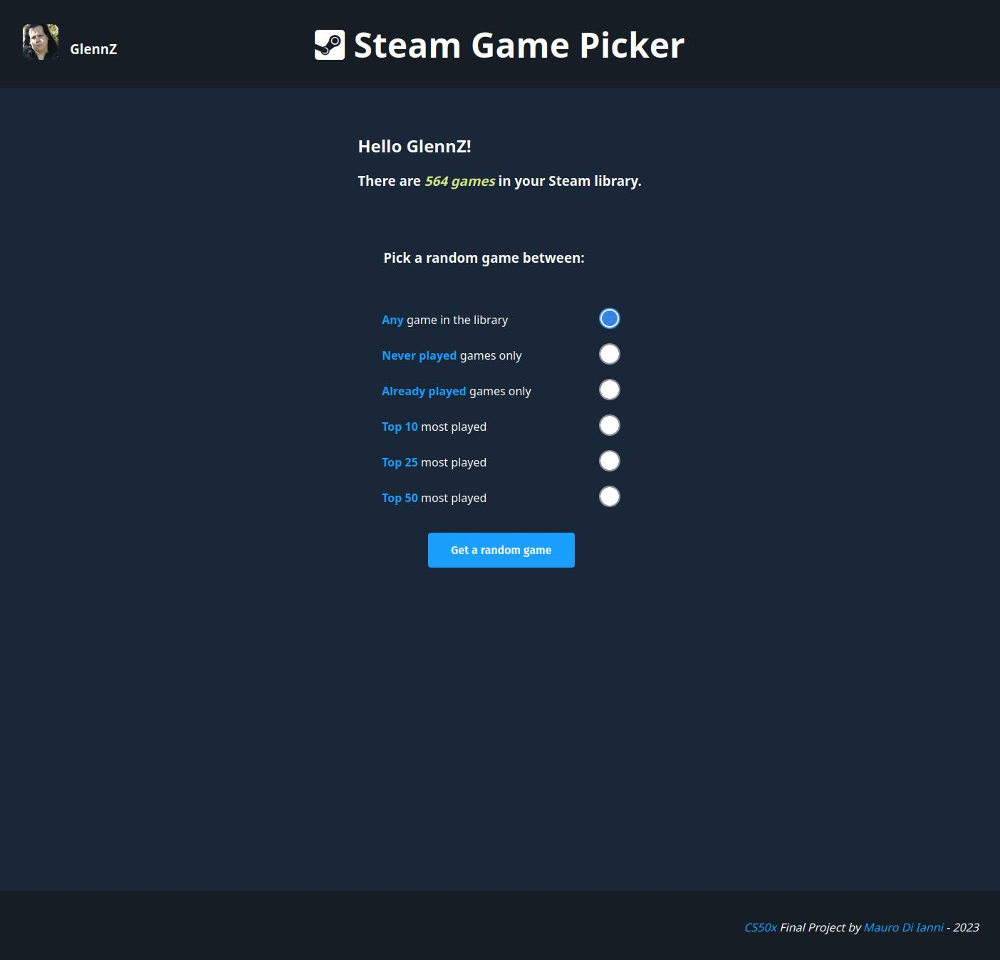

# Steam Game Picker

#### Video demo: https://peertube.tv/w/7AZzHBTtCuWDWcEXoWpuWB

_This is my final project for [Harvard's CS50x](https://cs50.harvard.edu/x/2023/)._

_Many thanks to professor David Malan and all the TAs that made CS50 such a great learning experience._

## Description:

Have you hoarded hundreds (or even thousands!) of videogames on your [Steam](https://steamcommunity.com/) account during the last few sales? 
Do you even remember what games are in your library anymore?
Or maybe you feel like playing a game but you can't decide which one because you have too many choices?

The *Steam Game Picker* will help you choose the next game to play!

### Home page:
First make sure you enter your [correct Steam username](https://www.wikihow.com/See-Your-Account-Name-in-Steam). Click the _submit_ button and the app will now load your library.

### Filters page:

Now you can choose between a few filters: 
- All the games in your library
- Only games that you've never played at all
- Only games that you have played before
- Your Top 10 most played games
- Your Top 25 most played games
- Your Top 50 most played games

Then you can click the button and the app will choose a random game between the ones in your specified selection.

### Result page:

Here you can click the title or the thumbnail of the game and get to its Steam store page. There is also some useful information about the game:
- How many hours you've played the game for
- The metacritic score
- The various game's genres

If you don't like the game you can click on the green button and try another pick with the same settings you've chosen before.
Or, with the blue button, you can go back to the filters' page and make a different selection.
## Technical description:

Steam Game Picker is a web application developed with the [Flask](https://github.com/pallets/flask) framework using an SQLite database.

It fetches data from the Steam API using the [python-steam-api](https://github.com/deivit24/python-steam-api) library made by [David Salazar](https://github.com/deivit24).

If you want to try it out on your local machine you'll have to follow a few steps:

- Get your own [Steam API key](https://steamcommunity.com/dev)
- Clone this repository
- Save your Steam API key in an `.env` file in the cloned repository as:
``` STEAM_API_KEY=<YOUR KEY HERE> ```
- Install all the python requirements with:
```$ pip install -r requirements.txt ```
- Run the Flask application with:
```python3 app.py```

I made it so it's quite easy to implement new filters, it's just a matter of writing a new SQL query, add a new case in app.py and update the HTML.
I might implement new filters in the future, for example selections based on genres or even moods.

### What's in the files:

The main aplication resides in `app.py`.

There also some functions that I wrote separatly for cleanliness in `helpers.py`.

In `schema.sql` there's the actual schema used by SQLite to build the `library.sql` database.

The (vanilla ) CSS file for the style is in the `static` directory.

All the HTML templates are in the `templates` directory.

## Screenshots:

### Home page



### Filters's page



### Result's page


